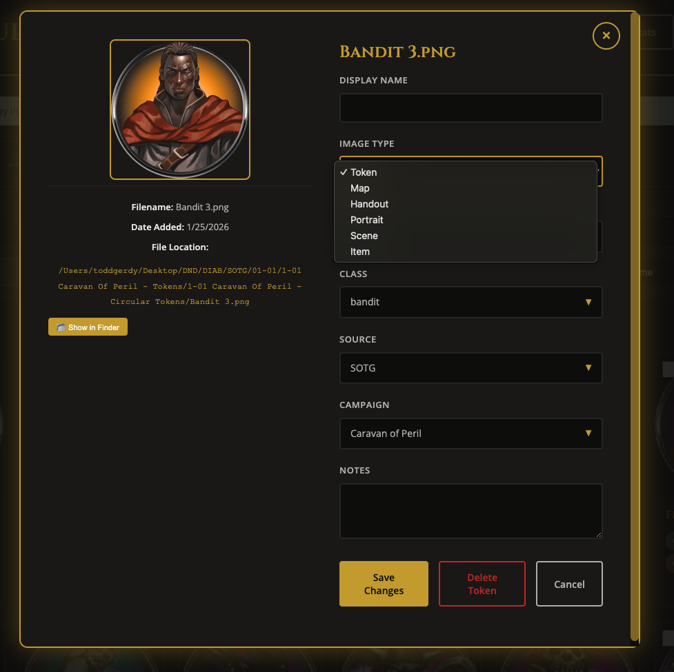
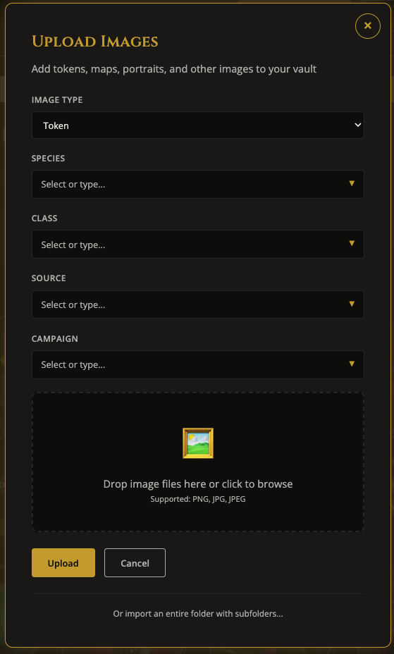
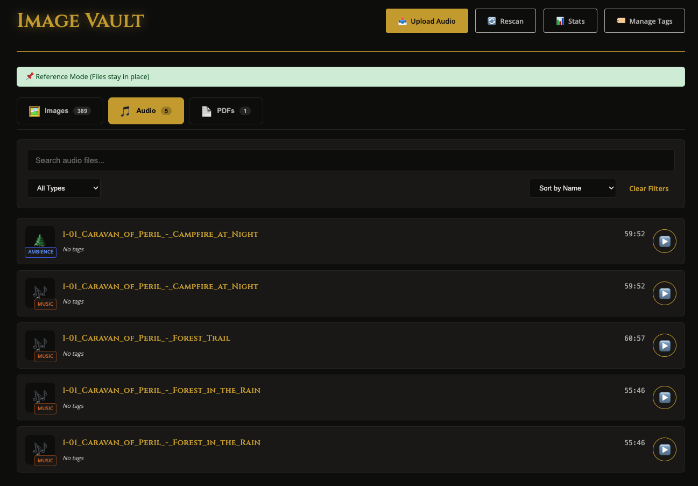

# Image Vault

> A local-first asset organizer for tabletop RPG Dungeon Masters that stores metadata directly in your image files — so your tags go wherever your images go.

A desktop app for managing your collection of RPG assets: character tokens, maps, handouts, portraits, scene art, items, music, sound effects, and rulebook PDFs. Built for D&D, Pathfinder, and other tabletop RPG players and DMs.

[View the project on GitHub](https://github.com/NerdyToddGerdy/automatic-eureka)

---

## Why I built this

I was digging through all of my GM folders looking for a Dwarven Cleric token. I couldn't find it anywhere — searched every folder I had. Then I went looking for a tavern map I knew I had, and went through the same hunt all over again. After enough of that, I realized what I actually needed wasn't more folders or better file names — it was an interface for browsing and tagging these images without storing them in two different places. That's Image Vault: it indexes your files right where they already live.

## What it does

- **Reference Mode** — Files stay exactly where they already live on disk; nothing is copied or moved. Point the app at your existing folders and it indexes them in place.
- **Three content types** — Tokens/Images (PNG, JPG), Audio (MP3, WAV, OGG, M4A, FLAC), and PDFs, each with their own gallery tab.
- **Metadata stored in the file itself** — For PNG and JPEG images, tags are written directly into the image file (PNG text chunks / JPEG EXIF), so they're never lost if the database is rebuilt. Audio and PDF tags live in the local index.
- **Six image types** — Token, Map, Handout, Portrait, Scene, Item — each with its own type-specific tag fields (Species/Class, Scale/Theme, Rarity/Category, and so on).
- **Search & filter** — Quickly find assets with powerful per-field filtering, plus global Source/Campaign tags shared across everything.
- **Bulk operations** — Update or delete multiple items at once.
- **Tag Manager** — Rename or merge a tag value across every item that uses it, in one operation.
- **Auto-scan** — Detects new files in your watched folders automatically, or trigger a manual rescan.
- **Dark fantasy theme** — Dark UI with gold accents, accessible focus states, and reduced-motion support.

### A closer look

**Browse and filter your gallery**


The Maps tab with Theme, Source, and Campaign filters applied — narrow a large collection down in seconds.

**Edit any item's tags**



Switch between the six image types — Token, Map, Handout, Portrait, Scene, Item — each with its own type-specific fields.

**Add files without copying them**



Add a single file by path; Reference Mode indexes it in place, nothing gets duplicated.

**Audio gets its own gallery**



Type badges, durations, and inline playback for music, sound effects, ambience, and dialogue.

<!-- TODO(author): the Import Folder wizard's per-subfolder tag step and a PDF tab screenshot
     are deferred — see automatic-eureka#42 — add them here once captured. -->

## Installing it locally

**Prerequisites**: Python 3.10+, Node.js 18+

1. Install Python dependencies:
   ```bash
   pip install -r requirements.txt
   ```

2. Install Node.js dependencies:
   ```bash
   npm install
   ```

3. Run the desktop app:
   ```bash
   npm start
   ```

The Electron app launches with Flask running in the background. A green "📌 Reference Mode" indicator confirms files are referenced in place, not copied.

> **Why Electron, not just a browser?** Image Vault only supports Reference Mode — there's no "copy files into a vault folder" mode. Adding files by path requires the absolute file-system paths that only Electron's bridge can provide; a plain browser can't do this.

---

[Full README, usage guide, and API docs →](https://github.com/NerdyToddGerdy/automatic-eureka#readme)
